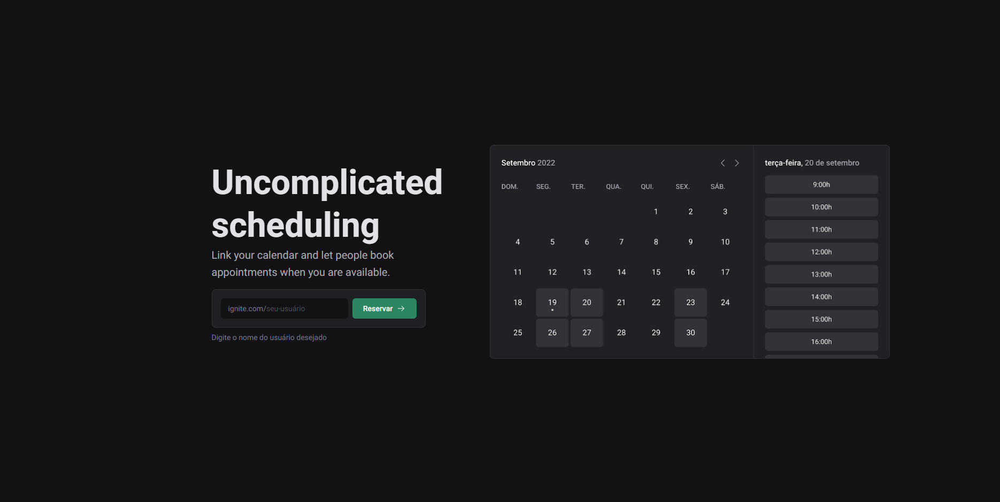

# Ignite Call




Ignite Call is a web application built using Next.js that enables users to seamlessly schedule times with one another and have those bookings automatically added to their Google Calendar. This application facilitates coordination and time management by offering a user-friendly interface to manage bookings and appointments.

This project was developed as part of a module in the [Rocketseat](https://www.rocketseat.com.br) Ignite Bootcamp, using the design system developed on a previous module.

## Deployment

The project was developed to Vercel and can be accessed [here](https://ignite-call-psi-peach.vercel.app)!

## Features

- Responsive design
- User authentication
- Schedule appointments with other users
- Automatically add bookings to Google Calendar

## Installation

If you prefer to run the project locally, these steps to get the project up and running:

1. **Clone the repository**
   ```bash
   git clone https://github.com/ArantesJoao/ignite-call.git
   cd ignite-call
    ```

2. **Install dependencies**
    ```bash
    npm install
    ```

3. **Environment Configuration**
You need to create a `.env` file with your Google API credentials and other environment-specific variables.

4. **Run the project**
    ```bash
    npm run dev
    ```

## Usage

1. **Sign in** with your Google account.
2. **Select** available time slots.
3. **Confirm** the appointment.
4. The booking will be **automatically added to your Google Calendar**.

## Tech Stack

- Next.js
- Prisma
- MySQL
- Google Calendar application
- Stitches
